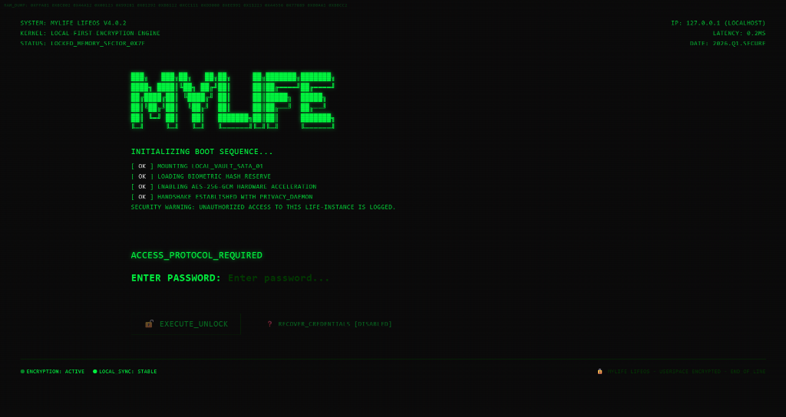
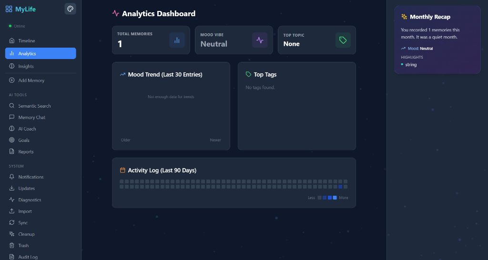
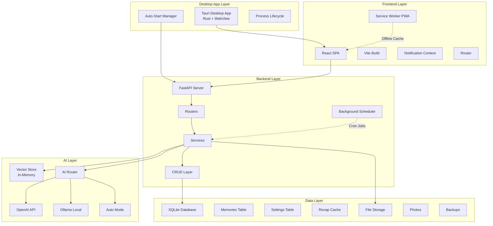
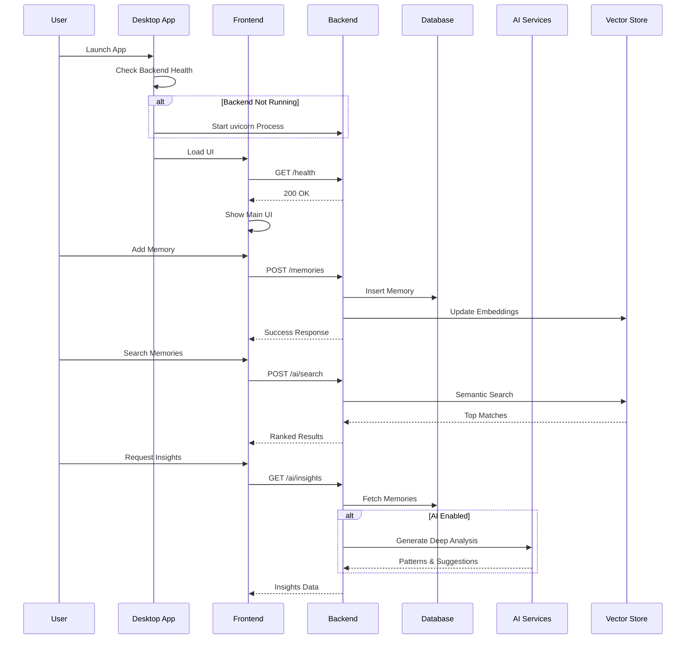
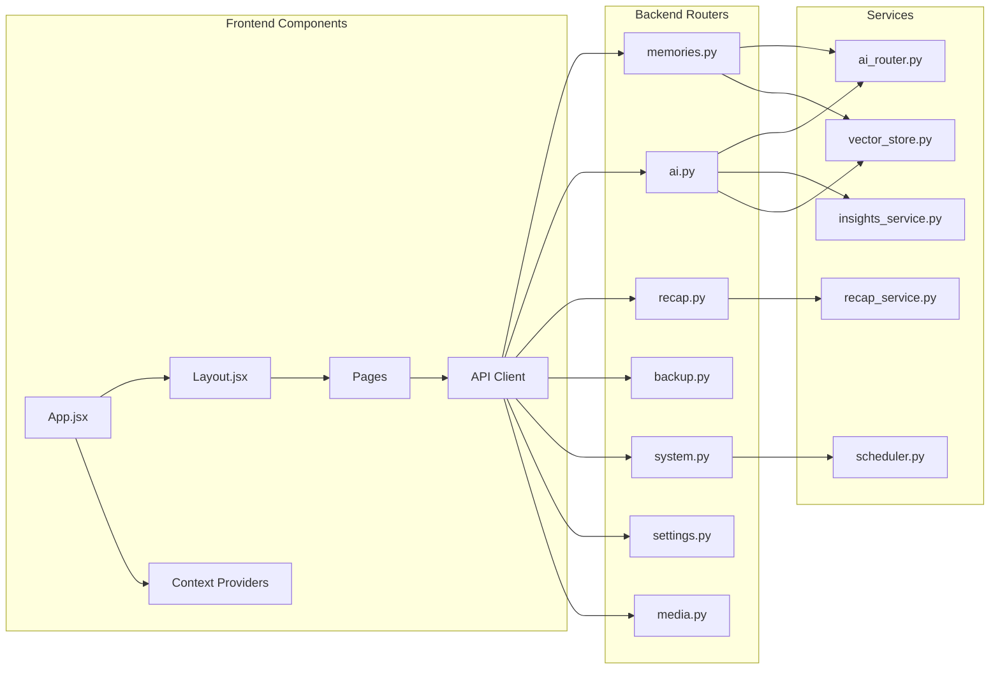
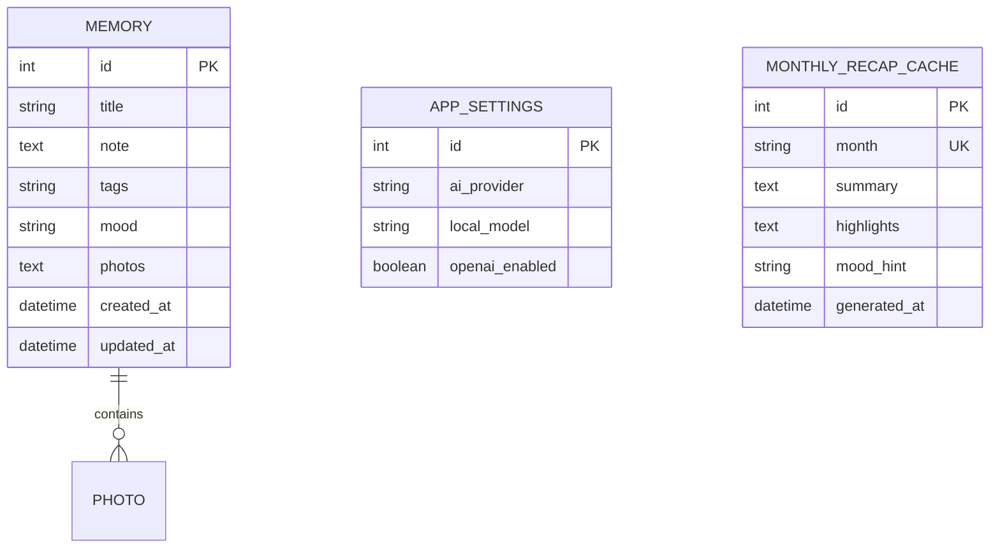
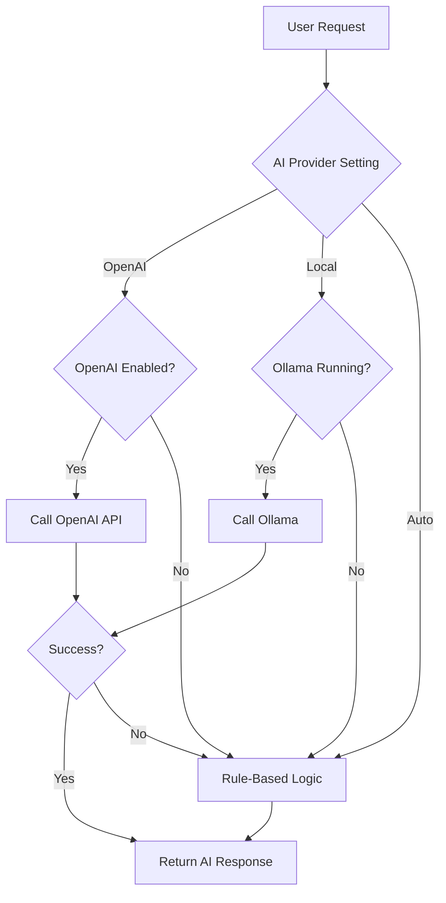

# MyLife - Personal journal for every Memory which you dont want to forget

<div align="center">


**Your memories, organized like an OS.**

A feature-rich, local-first personal journal with AI-powered insights, semantic search, and desktop app support.

</div>

---

## 📑 Table of Contents

- [Overview](#overview)
- [Architecture](#architecture)
- [Features](#features)
- [Technology Stack](#technology-stack)
- [Installation](#installation)
- [Usage](#usage)
- [API Documentation](#api-documentation)
- [Project Structure](#project-structure)
- [Development](#development)
- [Security](#security)
- [License](#license)

---

## 🌟 Overview

MyLife is a comprehensive personal memory management system that combines the power of modern AI with a beautiful, OS-inspired interface. It's designed to be **local-first**, ensuring your data remains private and secure while providing advanced features like semantic search, AI-powered insights, and automated backups.

### Key Highlights

- 🧠 **AI-Powered Intelligence**: Optional OpenAI/Ollama integration for chat and insights
- 🔍 **Semantic Search**: Find memories by meaning, not just keywords
- 📊 **Analytics & Insights**: Visualize mood patterns and behavioral trends
- 🔒 **Enterprise-Grade Security**: PIN lock, encrypted backups, local-first architecture
- 💾 **Offline-First**: Full PWA support with service worker caching
- 🖥️ **Cross-Platform**: Web app + Native desktop app (Tauri)
- 🔄 **Automated Workflows**: Background scheduler for recap generation

---

## 📸 Screenshots

### Terminal-Style Interface

*Retro CRT-inspired terminal login screen with ASCII art logo and green phosphor glow effects*

### Analytics Dashboard

*Beautiful analytics dashboard showing mood trends, activity heatmap, and comprehensive statistics with premium glassmorphism effects*

---

## 🏗️ Architecture

### System Architecture Diagram



### Data Flow Architecture



### Component Architecture



---

## 🆕 Latest Updates (v1.0.0 - January 2026)

### Recent Improvements
- ✅ **Vault System Simplified**: Removed mandatory vault encryption for easier access
- ✅ **Database Auto-Migration**: Safe schema updates on startup without data loss
- ✅ **Memory Chat UI**: Fixed layout rendering for proper message display
- ✅ **Persistent Storage**: Improved AppData-based database storage
- ✅ **UI Refinements**: Removed Lock Vault button, streamlined navigation
- ✅ **Error Handling**: Enhanced diagnostics and user feedback
- ✅ **Health Monitoring**: Better system status tracking

### Fixed Issues
- 🔧 Database schema mismatches (timestamp column auto-added)
- 🔧 Memory Chat container height and flex layout
- 🔧 Missing icon imports (RefreshCw, Activity)
- 🔧 Backend
 startup and connection reliability
- 🔧 Frontend hot-reload stability

---

## ✨ Features

### Core Features

#### 1. **Memory Management**
- Create, Read, Update, Delete memories
- Rich text notes with titles and tags
- Photo attachments (multi-upload support)
- Mood tracking (happy, calm, stressed, sad, excited, neutral)
- Automatic timestamps with update tracking

#### 2. **AI-Powered Search & Chat**
- **Semantic Search**: Find memories by context, not just keywords
- **Memory Chat**: Ask questions about your memories
- **AI Providers**:
  - **Auto Mode**: Rule-based, no external dependencies
  - **Local Mode**: Ollama integration for privacy
  - **OpenAI Mode**: GPT-3.5/4 for advanced capabilities

#### 3. **Analytics Dashboard**
- Total memories count
- Mood trend visualization (line chart)
- Top tags breakdown (bar chart)
- Activity heatmap (GitHub-style, 90 days)
- Client-side computation for speed

#### 4. **AI Insights**
- Monthly/period analysis
- Pattern recognition (behavioral trends)
- Actionable suggestions
- Focus areas identification
- Mood breakdown statistics

#### 5. **Backup & Restore**
- **Export**: ZIP archive of database + photos
- **Encryption**: AES-256 with PIN-derived keys (PBKDF2)
- **Restore**: Safe data replacement with rollback
- **Auto-Backups**: Scheduled via background jobs (optional)

#### 6. **Security Features**
- **App Lock**: PIN-based authentication on startup
- **Session Management**: Unlock persists per session
- **Encrypted Backups**: Military-grade encryption
- **Local-First**: All data stays on your device

#### 7. **Progressive Web App (PWA)**
- Offline support with Service Worker
- Install as desktop/mobile app
- Cache-first for static assets
- Network-first for API calls
- Offline status indicator

#### 8. **Desktop Application**
- Native Windows/Mac/Linux app via Tauri
- **Auto-Start Backend**: Launches FastAPI automatically
- Silent process management (no terminal windows)
- Custom window controls and theming
- Single-click launch experience

#### 9. **Background Automation**
- **Daily Recap Generation**: Runs at 01:00 local time
- **Embedding Refresh**: Every 10 minutes
- **Recap Caching**: Instant monthly summaries
- APScheduler for reliable job execution

#### 10. **Notification System**
- Centralized notification feed
- localStorage persistence
- Unread badge indicators
- Contextual notifications (backup, restore, settings)

#### 11. **Premium UI & Theme System** 🎨
- **Terminal-Style Login**: CRT-inspired green terminal with ASCII art logo
- **Discord-Like Themes**: 6 beautiful preset themes + custom theme builder
  - Midnight (default blue/purple)
  - Ocean (cyan/teal)
  - Sunset (orange/pink)
  - Forest (green)
  - Purple Dream (purple/magenta)
  - Rose (red/pink)
- **Custom Theme Builder**: Create your own color schemes with live preview
- **Persistent Themes**: Saved to localStorage, applies on reload
- **CSS Variables**: Instant theme switching across entire app

#### 12. **Immersive Visual Effects** ✨
- **Floating Particles**: 150 animated particles with glow effects
- **3D Memory Cards**: 
  - Interactive tilt based on mouse position
  - Shimmer animation following cursor
  - Mood-based gradient borders
  - Staggered tag animations
  - Sparkle icons on hover
- **Enhanced Timeline**: 
  - Vibrant gradient headers
  - Glassmorphism effects
  - Smooth fade-in animations
  - Emoji-enhanced mood filters
- **Ambient Background**: Subtle star-like particles creating depth

#### 13. **AI Companion - Lyra** 🤖
- **Emotional Support**: Active listening, validates emotions, celebrates successes
- **Communication Skills**: Warm conversational tone, thoughtful questions
- **Good Manners**: Respectful, kind, shows appreciation
- **Life Navigation**: Pattern recognition, coping strategies, goal setting
- **System Guidance**: Helps users understand MyLife features effectively
- **Smart Responses**: Context-aware with mood pattern analysis

#### 14. **Bundled Desktop Build** 📦
- **Zero Installation**: No Python required for users
- **PyInstaller Backend**: FastAPI bundled as `mylife-backend.exe`
- **Auto-Start Backend**: Launches automatically on app start
- **AppData Storage**: All data in `%APPDATA%\MyLife\` (Windows best practices)
- **Single Installer**: One `.msi` file includes everything
- **Smart Launcher**: Auto-detects dev vs production mode
- **Graceful Shutdown**: Backend stops cleanly when app closes

---

## 🛠️ Technology Stack

### Backend

| Component | Technology | Purpose |
|-----------|-----------|---------|
| **Framework** | FastAPI | High-performance async API |
| **Database** | SQLite | Lightweight, file-based storage |
| **ORM** | SQLAlchemy | Database abstraction |
| **AI/ML** | sentence-transformers | Semantic embeddings |
| **Scheduler** | APScheduler | Background task automation |
| **Encryption** | cryptography | Backup encryption (Fernet) |
| **AI Providers** | OpenAI SDK, Ollama | Optional AI capabilities |

### Frontend

| Component | Technology | Purpose |
|-----------|-----------|---------|
| **Framework** | React 18 | UI library |
| **Build Tool** | Vite | Fast dev server & bundling |
| **Routing** | React Router v6 | SPA navigation |
| **Styling** | Tailwind CSS | Utility-first CSS |
| **Icons** | Lucide React | Icon library |
| **PWA** | vite-plugin-pwa | Service Worker generation |

### Desktop

| Component | Technology | Purpose |
|-----------|-----------|---------|
| **Framework** | Tauri 1.6 | Native app wrapper |
| **Backend** | Rust | System-level operations |
| **Process Mgmt** | std::process | Backend lifecycle control |
| **HTTP Client** | reqwest | Health check requests |

### Development Tools

- **Python**: 3.8+ (Backend runtime)
- **Node.js**: 18+ (Frontend build)
- **Rust**: 1.70+ (Tauri compilation)
- **VS Code**: Recommended IDE

---

## 📦 Installation

### Prerequisites

```bash
# Backend
- Python 3.8+
- pip

# Frontend
- Node.js 18+
- npm

# Desktop (Optional)
- Rust 1.70+
- Microsoft Visual Studio C++ Build Tools (Windows)
```

### Step 1: Clone Repository

```bash
git clone https://github.com/yourusername/MyLife.git
cd MyLife
```

### Step 2: Backend Setup

```bash
cd backend

# Create virtual environment
python -m venv venv

# Activate (Windows)
venv\Scripts\activate

# Activate (Linux/Mac)
source venv/bin/activate

# Install dependencies
pip install -r requirements.txt
```

### Step 3: Frontend Setup

```bash
cd ../frontend

# Install dependencies
npm install
```

### Step 4: (Optional) Tauri Setup

```bash
# Windows (Admin PowerShell)
winget install --id Rustlang.Rustup
winget install --id Microsoft.VisualStudio.2022.BuildTools

# Verify Rust installation
rustc --version
```

---

## 🚀 Usage

### Web Application Mode

#### Terminal 1: Start Backend

```bash
cd backend
python -m venv venv
venv\Scripts\activate  # Windows
uvicorn app.main:app --reload
```

Backend runs at: `http://127.0.0.1:8000`

#### Terminal 2: Start Frontend

```bash
cd frontend
npm run dev
```

Frontend runs at: `http://localhost:5173`

### Desktop Application Mode (Development)

```bash
cd frontend

# Development
npm run tauri dev

# Production Build
npm run tauri build
```

The desktop app automatically:
1. Checks if backend is running (`http://127.0.0.1:8000/health`)
2. Starts backend process if not found
3. Shows splash screen while initializing
4. Loads main UI when ready

### Desktop Bundled Build (No Python Required) 🚀

Build a complete Windows installer with bundled backend:

```powershell
# Option 1: Complete build script (recommended)
.\build_desktop.ps1

# Option 2: Manual steps
cd backend
pip install pyinstaller
pyinstaller mylife-backend.spec
Copy-Item dist\mylife-backend.exe ..\frontend\src-tauri\resources\

cd ..\frontend
npm run tauri build
```

**Output:** `frontend/src-tauri/target/release/bundle/msi/MyLife_*.msi`

**Features:**
- ✅ Single installer includes everything
- ✅ No Python installation needed
- ✅ Backend auto-starts/stops with app
- ✅ Data stored in `%APPDATA%\MyLife\`
- ✅ ~150-250 MB installer size

See [BUILD_DESKTOP.md](BUILD_DESKTOP.md) for detailed instructions.

---

## 📚 API Documentation

### Base URL

```
http://127.0.0.1:8000
```

### Response Format

All endpoints follow this structure:

```json
{
  "success": true,
  "data": { ... },
  "error": null
}
```

### Endpoint Groups

#### Memories API

| Method | Endpoint | Description |
|--------|----------|-------------|
| GET | `/memories` | List all memories (filtered by month) |
| POST | `/memories` | Create new memory |
| GET | `/memories/{id}` | Get specific memory |
| PUT | `/memories/{id}` | Update memory |
| DELETE | `/memories/{id}` | Delete memory |
| POST | `/memories/{id}/photos` | Attach photos to memory |

#### AI API

| Method | Endpoint | Description |
|--------|----------|-------------|
| POST | `/ai/search` | Semantic search memories |
| POST | `/ai/chat` | Chat with memory assistant |
| GET | `/ai/insights` | Get behavioral insights |
| GET | `/ai/models` | List available Ollama models |

#### Recap API

| Method | Endpoint | Description |
|--------|----------|-------------|
| GET | `/recap/monthly?month=YYYY-MM` | Get monthly summary |

#### Backup API

| Method | Endpoint | Description |
|--------|----------|-------------|
| GET | `/backup/export?pin=xxxx` | Download encrypted backup |
| POST | `/backup/restore` | Restore from backup file |

#### System API

| Method | Endpoint | Description |
|--------|----------|-------------|
| GET | `/system/status` | Get scheduler & job status |
| GET | `/health` | Health check endpoint |

#### Settings API

| Method | Endpoint | Description |
|--------|----------|-------------|
| GET | `/settings/ai` | Get AI configuration |
| PUT | `/settings/ai` | Update AI settings |

### Example API Calls

#### Create Memory

```bash
curl -X POST http://127.0.0.1:8000/memories \
  -H "Content-Type: application/json" \
  -d '{
    "title": "Great Day at Work",
    "note": "Finished the project ahead of schedule!",
    "mood": "happy",
    "tags": "work, achievement"
  }'
```

#### Semantic Search

```bash
curl -X POST http://127.0.0.1:8000/ai/search \
  -H "Content-Type: application/json" \
  -d '{
    "query": "stressful moments at work",
    "top_k": 5
  }'
```

#### Export Encrypted Backup

```bash
curl -X GET "http://127.0.0.1:8000/backup/export?pin=1234" \
  --output mylife-backup.encrypted
```

---

## 📂 Project Structure

```
MyLife/
├── backend/                    # FastAPI Backend
│   ├── app/
│   │   ├── __init__.py
│   │   ├── main.py            # App entry point + scheduler setup
│   │   ├── config.py          # Configuration + AppData paths
│   │   ├── database.py        # SQLAlchemy setup
│   │   ├── models.py          # Database models (Memory, Settings, RecapCache)
│   │   ├── schemas.py         # Pydantic schemas
│   │   ├── crud.py            # Database operations
│   │   ├── routers/           # API endpoints
│   │   │   ├── memories.py    # Memory CRUD
│   │   │   ├── ai.py          # AI features (search, chat, insights)
│   │   │   ├── recap.py       # Monthly summaries
│   │   │   ├── backup.py      # Backup/restore
│   │   │   ├── settings.py    # App configuration
│   │   │   ├── media.py       # Photo uploads
│   │   │   └── system.py      # System status
│   │   └── services/          # Business logic
│   │       ├── ai_router.py   # AI provider orchestration (Lyra)
│   │       ├── recap_service.py  # Recap generation
│   │       ├── insights_service.py # Deep analysis
│   │       ├── vector_store.py    # Semantic embeddings
│   │       └── scheduler.py       # Background jobs
│   ├── storage/               # File storage
│   │   ├── photos/            # Uploaded images
│   │   └── backups_tmp/       # Temporary backup files
│   ├── requirements.txt       # Python dependencies
│   ├── mylife-backend.spec    # PyInstaller configuration
│   └── create_exe.ps1         # Backend exe build script
│
├── frontend/                   # React Frontend
│   ├── src/
│   │   ├── main.jsx           # React entry + PWA registration
│   │   ├── App.jsx            # Root component + routing
│   │   ├── index.css          # Global styles (Tailwind + theme variables)
│   │   ├── api/
│   │   │   └── client.js      # API wrapper
│   │   ├── components/        # Reusable components
│   │   │   ├── Layout.jsx     # App shell (sidebar, main, panel)
│   │   │   ├── RecapCard.jsx  # Monthly summary widget
│   │   │   ├── MemoryCard.jsx # 3D interactive memory card
│   │   │   ├── FloatingParticles.jsx # Background animation
│   │   │   ├── ThemeSelector.jsx     # Theme switcher UI
│   │   │   └── StatusMessage.jsx # Loading/error states
│   │   ├── context/           # Global state
│   │   │   ├── NotificationContext.jsx
│   │   │   └── ThemeContext.jsx      # Theme management
│   │   └── pages/             # Route pages
│   │       ├── Timeline.jsx   # Home page (memory feed)
│   │       ├── AddMemory.jsx  # Create memory form
│   │       ├── MemoryDetail.jsx # Single memory view
│   │       ├── SemanticSearch.jsx # AI search
│   │       ├── MemoryChat.jsx     # AI chat with Lyra
│   │       ├── Analytics.jsx      # Charts & stats
│   │       ├── Insights.jsx       # AI insights
│   │       ├── Settings.jsx       # Configuration
│   │       ├── SystemStatus.jsx   # Scheduler status
│   │       ├── Notifications.jsx  # Notification center
│   │       ├── TerminalLogin.jsx  # CRT-style login screen
│   │       └── LockScreen.jsx     # PIN entry
│   ├── src-tauri/             # Tauri Desktop App
│   │   ├── src/
│   │   │   └── main.rs        # Rust entry (smart backend launcher)
│   │   ├── resources/         # Bundled files
│   │   │   └── mylife-backend.exe  # (Created by build)
│   │   ├── Cargo.toml         # Rust dependencies
│   │   ├── build.rs           # Build script
│   │   └── tauri.conf.json    # App configuration
│   ├── public/                # Static assets
│   ├── .env.production        # Production environment config
│   ├── vite.config.js         # Vite configuration
│   ├── tailwind.config.js     # Tailwind configuration
│   └── package.json           # Node dependencies
│
├── build_desktop.ps1          # Complete desktop build script
├── BUILD_DESKTOP.md           # Desktop build documentation
├── mylife.db                  # SQLite database (generated)
├── .gitignore
├── LICENSE
└── README.md                  # This file
```

---

## 🔧 Development

### Database Schema



### AI Provider Flow



### Building for Production

#### Backend

```bash
# No build step needed - Python runs directly
# For deployment, consider:
# - Docker containerization
# - Systemd service (Linux)
# - Windows Service wrapper
```

#### Frontend (Web)

```bash
cd frontend
npm run build
# Output: frontend/dist/
# Deploy to static hosting (Netlify, Vercel, etc.)
```

#### Desktop App

```bash
cd frontend
npm run tauri build

# Output locations:
# Windows: src-tauri/target/release/bundle/msi/
# Mac: src-tauri/target/release/bundle/dmg/
# Linux: src-tauri/target/release/bundle/appimage/
```

---

## 🔒 Security

### Data Privacy

- **Local-First**: All data stored locally in SQLite
- **No Cloud Sync**: No automatic data transmission
- **Optional AI**: External AI providers are opt-in only

### Encryption

- **Backup Encryption**: AES-256-CBC with PBKDF2 key derivation
- **PIN Hashing**: Client-side hashing before storage (basic)
- **HTTPS Ready**: Backend can run behind reverse proxy

### Best Practices

1. **Change Default PIN**: Set a strong PIN immediately
2. **Backup Regularly**: Use encrypted backups
3. **Update Dependencies**: Keep packages up to date
4. **Environment Variables**: Store API keys in `.env` files (not committed)

### Security Considerations

- PIN hashing is basic (client-side only) - consider upgrading to bcrypt/argon2
- Tauri app runs backend with user privileges - no privilege escalation
- SQLite file permissions inherit from OS user settings

---

## 🎨 UI/UX Design

### Design System

- **Color Palette**: Dark OS-inspired theme
  - Background: `#0a0a0a` (os-bg)
  - Panel: `#151515` (os-panel)
  - Accent: `#3b82f6` (blue-500)
  - Hover: `#1f1f1f` (os-hover)

- **Typography**: System fonts with fallbacks
- **Icons**: Lucide React (consistent, lightweight)
- **Animations**: Tailwind transitions + custom animations

### Responsive Design

- Mobile-first approach
- Breakpoints: `sm:640px`, `md:768px`, `lg:1024px`, `xl:1280px`
- Sidebar collapses on small screens
- Right panel hidden below `xl` breakpoint

---

## 🐛 Troubleshooting

### Backend won't start

```bash
# Check if port 8000 is in use
netstat -ano | findstr :8000

# Kill process (Windows)
taskkill /PID <PID> /F

# Verify Python version
python --version  # Should be 3.8+
```

### Frontend build errors

```bash
# Clear cache
cd frontend
rm -rf node_modules package-lock.json
npm install
```

### Tauri build fails

```bash
# Verify Rust installation
rustc --version
cargo --version

# Update Rust
rustup update

# Clean build
cd frontend/src-tauri
cargo clean
```

### Database errors

```bash
# Reset database (WARNING: Deletes all data)
cd backend
python reset_db.py
```

---

## 🤝 Contributing

Contributions are welcome! Please follow these guidelines:

1. Fork the repository
2. Create a feature branch (`git checkout -b feature/AmazingFeature`)
3. Commit your changes (`git commit -m 'Add some AmazingFeature'`)
4. Push to the branch (`git push origin feature/AmazingFeature`)
5. Open a Pull Request

### Code Style

- **Python**: Follow PEP 8
- **JavaScript**: ESLint + Prettier (Auto-format on save)
- **Rust**: `cargo fmt`

---

## 📝 License

This project is licensed under the Apache License 2.0 - see the [LICENSE](LICENSE) file for details.

---

## 🙏 Acknowledgments

- **FastAPI**: For the amazing Python framework
- **React Team**: For the robust UI library
- **Tauri**: For making cross-platform desktop apps simple
- **Sentence Transformers**: For semantic embeddings
- **OpenAI**: For powering advanced AI features
- **Ollama**: For local AI capabilities

---

## 📞 Support

- **Issues**: [GitHub Issues](https://github.com/yourusername/MyLife/issues)
- **Discussions**: [GitHub Discussions](https://github.com/yourusername/MyLife/discussions)

---

<div align="center">

**Made with ❤️ for your sweet memories **

⭐ Star this repo if you find it useful!

</div>
